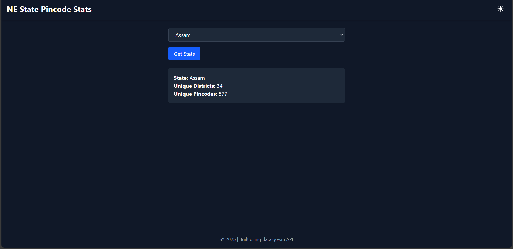

# North Eastern States Pincode & District Counter

This is a simple Vite + React application that allows users to select one of the 7 North Eastern states of India and fetch the total number of **unique pincodes** and **unique districts** using data from [data.gov.in](https://data.gov.in).

## 🔗 Live Demo

_Deployed at:_ [Your Netlify/GitHub Pages URL]

---

## 🛠️ Features

- Select from 7 North Eastern states:  
  `["Assam", "Mizoram", "Meghalaya", "Manipur", "Nagaland", "Tripura", "Sikkim"]`
- Fetches data from the official Indian government API.
- Displays:
  - Total number of unique pincodes
  - Total number of unique districts
- Uses `axios` for data fetching.
- Deployed with Vite for fast frontend performance.

---

## 📦 Tech Stack

- **Frontend:** Vite + React
- **HTTP Client:** Axios
- **Deployment:** Netlify / GitHub Pages
- **API Source:** [https://data.gov.in](https://data.gov.in)

---

## 📂 Setup Instructions

### 1. Clone the repo

```bash
git clone https://github.com/yourusername/pincode-north-east.git
cd pincode-north-east
````

### 2. Install dependencies

```bash
npm install
```

### 3. Configure your environment variables

Create a `.env` file in the root folder and add your API key and resource ID:

```
VITE_API_KEY=your_actual_api_key
VITE_RESOURCE_ID=your_actual_resource_id
```

### 4. Run the app locally

```bash
npm run dev
```

---

## 🚀 Deployment

* Deploy to **Netlify** or **GitHub Pages** using the build output.
* Build the app:

```bash
npm run build
```

* Upload the `dist` folder to your hosting platform.

---

## 🧪 Sample Output

* Selected State: **Assam**
* Unique Pincodes: `577`
* Unique Districts: `34`

